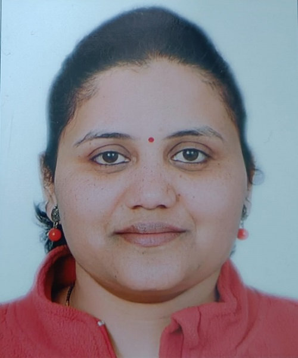

# **SWARANJALI**
### A Vocal Music Course for Beginners

### [Click here to register](https://forms.office.com/r/KbWcdKXtgf)

First batch: 30 May - 10 June 2022  
Second batch: 13 June - 25 June 2022  
Eight classes of 1 hour each  
Venue: LHC  
Timings: After 5 PM  
Two Batches
Open to all above 10 years of age  
No Fees; Limited Seats  

This course takes you on a melodious 
journey of music. It starts with the introduction of 
swara where participants are taught about seven 
swaras. The course will then show how to blend 
various musical notes (simple and complex notes). 
After getting how to combine notes the 
participants will learn about sargam. Some 
devotional songs will also be taught in this course. 
Tal-gyaan is an important aspect of Indian music, 
and the participants will learn about that as well. 
Followed by that the study of musical structure: 
what makes musical compositions work will also 
be taught.
This course will also emphasise on teaching 
participants how to control their breathing, 
maintain proper posture, and learning the correct intonation of svaras with the help of voice education. All of these factors contribute 
significantly to the development of a good 
vocalist
 
 

## **What you will learn**
- Basics of Indian Classical Music
- Foundational Concepts of Svaras
- Learning Alankaar, Paltas and basic Taals
- Devotional Songs

## **Our Music Teacher**

**Mrs. Kajal heer**
 M.Phil., UGC - NET
 2 yrs teaching experience

 

**Mrs. Renu Chavan**
 M.A. Music (Vocal)
 Vocalist All India Radio (2006)
 "Nagm-e-Sagar", Bal-Gandharv, Pune, 2004
 At various workshos and conferences, IIT Kanpur
 
 
 
 

**Venue:**  Lecture Hall Complex, IIT Kanpur
**Contact:**  Shiv Narayan Pandey, shivnp@iitk.ac.in 

